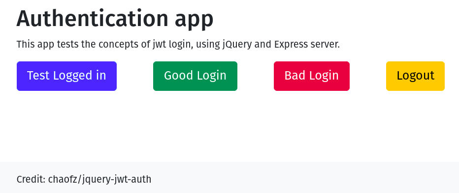

# jQuery JWT authentication

Simple website playground to experiment with jQuery and Express server authentication using JWT.



Original code forked from [chaofz/jquery-jwt-auth](https://github.com/chaofz/jquery-jwt-auth) 

## Requirements

Nodejs or Docker

## Quick start

### Yarn and node.js

Install with yarn (or npm), start the server with node.js.

```shell
yarn
# or: npm install
node server.js
```

Open <localhost:8080> and click the buttons.

### Docker

Docker has been included to allow the environment to be “spun up“ using a node12 alpine image. A Makefile contains many 
of the useful commands required.

- With make:

```shell
make install
make up
```

- Or with docker

Make will run the equivalent of:

```shell
docker run -u $(id -u):$(id -g) -v $(pwd):/app -w /app --rm -it node:12.18.4-alpine yarn
docker-compose up --build --remove-orphans -d server
```

These commands are for Linux, adjust for Mac or Windows.

## Explanation

Each button will perform an ajax call to the Express server.

### Test Logged in

The Test Logged in button will make a GET call to **/api/profile**, if a token is in localStorage it will be supplied in 
the request header.

The response will display:

- **success**: “Hello john.doe! You have successfully accessed to /api/profile“
- **error**: “Sorry, you are not logged in“

### Good Login

The good login button will make a POST call to **/login** with the user **john.doe** and password **foobar**

The response will display:

- **success**: “Got a token from the server! Token: with the token details“
- **error**: “Login Failed“

### Bad Login

The bad login button will make a POST call to **/login** with the user **john.doe** and password **foobarfoobar** 
(incorrect password)

- **success**: “ERROR: it is not supposed to alert“
- **error**: “Login Failed“

### Logout

The Logout button will check the token in localStorage.

- **No token** : “No token“
- **Token has expired (max age 1 min)**: token removed and “Token expired, logout successful“ displayed
- **Token hasn't expired**: token removed and “Logout successful” displayed

## Source code

- **index.html**: Basic website with the four buttons. Bootstrap and jQuery are installed using CDNs.
- **script.js**: jQuery script
- **server.js**: Express server with JWT included.
